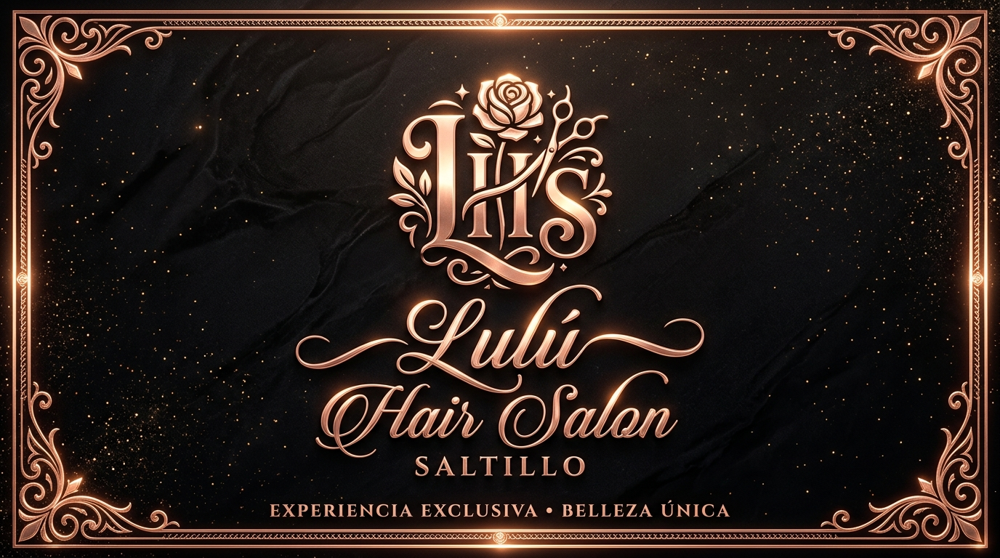

# Lulú Hair Salon • Saltillo, Coahuila

  

  <strong>Alta Alquimia Capilar de Lujo • Fórmulas Profesionales de Salón</strong> 
  <em>Atelier &amp; Boutique en Saltillo, Coahuila • Envíos a todo México</em>

---

## ✨ Características Técnicas
- **100% HTML5 Semántico & CSS3 Puro** (Cero dependencias, cero JavaScript).
- **Identidad Visual Premium**: Paleta Negro Obsidiana (`#0D0D0F`), Oro Rosa degradado y tipografías editoriales (`Playfair Display` + `Montserrat`).
- **Arquitectura Completa**:
  - Top Announcement Bar con información de envíos y pickup local.
  - Header sticky con navegación, emblema oficial y bolsa de compra interactiva.
  - Hero Section editorial de alto impacto con modelo de salón.
  - 4 Pilares de confianza (Cruelty-Free, Plex Bond-Repair, Sin Sulfatos, Asesoría).
  - Catálogo interactivo con 6 productos cosméticos generados en 8K.
  - Drawer lateral (Slide-Over) de Carrito de Compras en puro CSS.
  - Filtros por categoría y modales de Vista Rápida (*Quick View*).
  - Módulo interactivo de Diagnóstico Capilar Express.
  - Sección de Salón en Saltillo (Atelier & Mall del Noreste).
  - Muro de testimonios VIP y suscripción al Club Privado.

---

## 📸 Identidad de Marca y Ubicación
- **Sucursal Principal**: Distrito Residencial / Atelier Saltillo, Coahuila.
- **Boutique**: Mall del Noreste, Saltillo.
- **Envíos**: Cobertura nacional en México y Pickup gratuito en salón.
